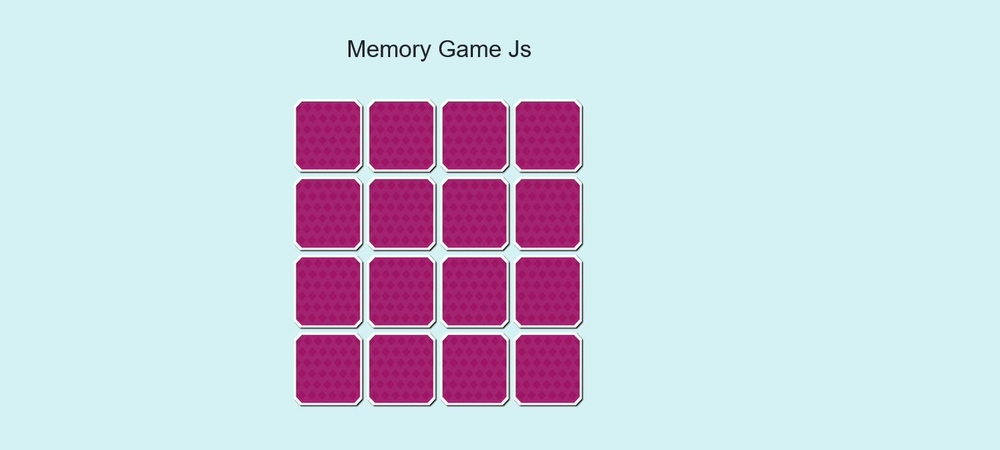
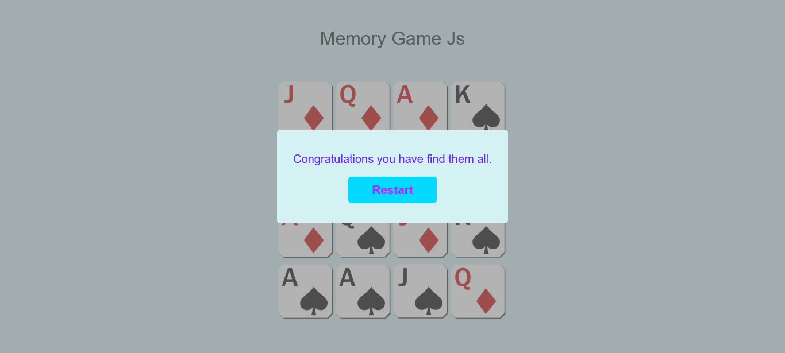

# Memory Game Js

Memory Game practice with Javascript.

## Overview

### Screenshot

## My process

### Built with

- HTML5
- CSS3
- Flexbox and Grid
- Mobile-first Responsive Design
- Bootstrap
- Javascript
- [SASS](https://sass-lang.com/)

### What I learned

- jQuery

## Contact

- [Linkedin](https://id.linkedin.com/in/dyota-samudriawan)
- Github - [@samudriawan](https://github.com/samudriawan/)
- Twitter - [@samudriawan](https://twitter.com/samudriawan)
- Frontend Mentor - [@samudriawan](https://www.frontendmentor.io/profile/samudriawan)
